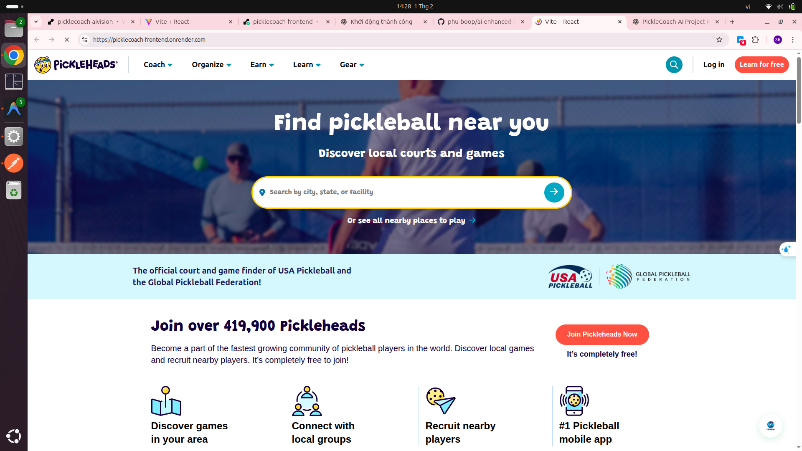
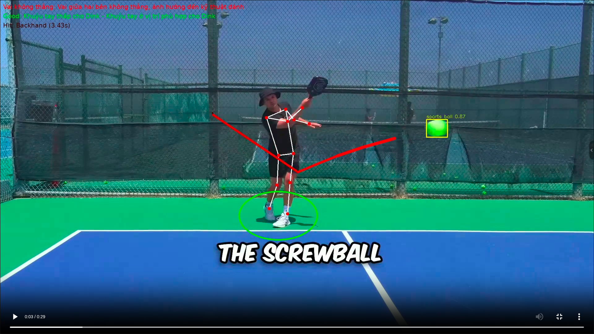
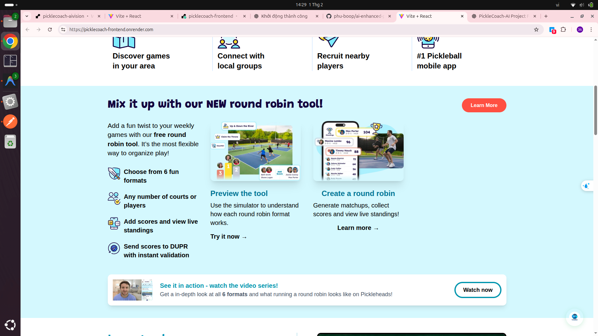
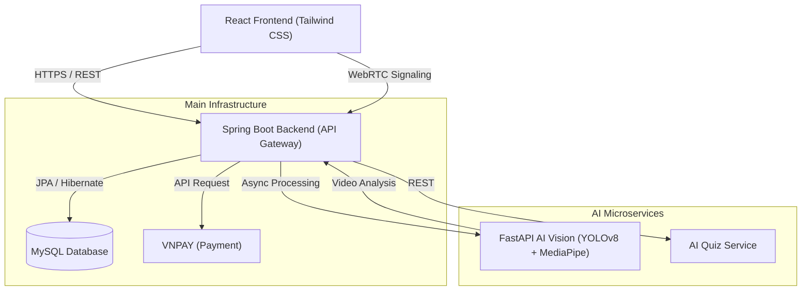

# 🏓 PickleCoach-AI | AI-Enhanced Pickleball Coaching Platform

[](https://spring.io/projects/spring-boot)
[](https://react.dev/)
[](https://fastapi.tiangolo.com/)
[](https://www.docker.com/)
[](LICENSE)

An end-to-end, AI-enhanced platform for Pickleball enthusiasts. This project bridges the gap between traditional coaching and modern technology by providing real-time AI analysis, WebRTC video calls, and a comprehensive management system for Learners, Coaches, and Administrators.

---

## 🔗 Live Demo
- 🌐 **Frontend**: [https://picklecoach-frontend.onrender.com](https://picklecoach-frontend.onrender.com)
- 🧠 **AI Service**: [https://picklecoach-aivision.onrender.com](https://picklecoach-aivision.onrender.com)
- 📊 **Main Backend**: [https://picklecoach-backend.onrender.com](https://picklecoach-backend.onrender.com)

## 🔐 Test Accounts
> [!IMPORTANT]
> The following credentials are for **demonstration purposes only**. Passwords are periodically reset, and sensitive data is rotated automatically to ensure system integrity.

| Role | Email | Password |
|------|-------|----------|
| **Admin** | `admin@gmail.com` | `123123123` |
| **Coach** | `coach@gmail.com` | `123123123` |
| **Learner** | `learner@gmail.com` | `123123123` |

## 🖼️ Screenshots
| Platform Overview | AI Feature Analysis |
|------------------|------------|
|  |  |

| Technical Highlights |
|----------------------|
|  |

---

## 🌟 Vision & Impact

Pickleball is the fastest-growing sport in the world, yet personalized coaching remains expensive and geographically limited. **PickleCoach-AI** democratizes professional coaching by:
- Using **Computer Vision** to provide objective technique feedback.
- Facilitating **Remote Coaching** through zero-latency WebRTC integration.
- Automating **Curriculum Management** using AI-driven course recommendations.

---

## 🚀 Key Features

### 👨‍🎓 For Learners
- **AI Studio**: Upload game footage for frame-by-frame pose analysis and ball tracking.
- **Smart Scheduling**: Seamlessly book and pay for 1-on-1 sessions.
- **Interactive Quizzes**: AI-generated adaptive quizzes to reinforce strategy.
- **Personalized Roadmap**: Get drill suggestions based on detected technique errors.

### 🧑‍🏫 For Coaches
- **Verified Profiles**: Show certifications and specialized expertise.
- **Remote Coaching**: Conduct zero-latency sessions via integrated WebRTC.
- **Financial Dashboard**: Track earnings, payments, and student progress.
- **Schedule Management**: Automated booking with calendar synchronization.

### 🛡️ For Administrators
- **System Analytics**: Real-time visualization of user growth and revenue.
- **Content Moderation**: Audit courses, materials, and coach applications.

---

## 🧠 What I Built (Engineering Highlights)
- **Full-Stack Architecture**: Designed and implemented a multi-service system using React, Spring Boot, and FastAPI.
- **AI-Powered Analysis**: Integrated **YOLOv8** for real-time ball detection and **MediaPipe** for 3D pose estimation to provide automated technical feedback.
- **Real-Time Communication**: Built a custom WebRTC signaling server using WebSockets to enable zero-latency video coaching.
- **Asynchronous Processing**: Developed a robust video processing pipeline capable of handling large files without blocking main application threads.
- **Scalable Infrastructure**: Containerized all services using Docker and configured automated blueprints for cloud deployment.

## 🎓 What I Learned
- **System Design**: Managing complex interactions between Java/Spring (Business Logic) and Python/FastAPI (AI Logic).
- **WebRTC Complexity**: Handling ICE candidates, STUN/TURN servers, and peer-to-peer negotiation.
- **AI Optimization**: Deploying ML models in resource-constrained cloud environments (Render/Docker).
- **Security Best Practices**: Implementing RBAC (Role-Based Access Control) and securing real-time signaling channels.

---

## 🧩 System Architecture



---

## 🧪 Testing & Quality
- **Backend**: JUnit 5, Mockito for comprehensive Service & Controller layers testing.
- **Frontend**: Manual E2E testing for complex booking & payment flows.
- **API Quality**: Standardized RESTful endpoints documented and tested via Postman.

## 🔐 Security
- **JWT-based Authentication** with secure token refresh cycles.
- **RBAC (Role-Based Access Control)**: Strict boundaries for Learner, Coach, and Admin roles.
- **Secure Signaling**: WebRTC handshake is protected via Spring Security.
- **Environment Management**: Sensitive keys managed via Docker Secrets and Render Environment Variables.

---

## 📁 Repository Structure

```text
picklecoach-ai/
├── pickleball/
│   ├── frontend/        # React + Tailwind CSS
│   ├── backend/         # Java Spring Boot 3 API
│   └── docker/          # Docker Compose configurations
├── PickleballAIVision/  # FastAPI AI Service (Python)
├── Pickeball_AI_Quizz/   # AI Quiz Engine (Python)
├── Screenshots1.png     # Platform Overviews
├── Screenshots2.png     # Technical Highlights
├── Screenshot3.png      # AI Analysis Preview
├── CONTRIBUTING.md      # Development Guidelines
├── LICENSE              # MIT License
├── seed_data.sql        # Database initialization
└── README.md
```

---

## 🗺️ Roadmap
- [ ] **Real-time Pose Feedback**: Direct feedback during live WebRTC sessions.
- [ ] **Mobile Application**: Cross-platform app using React Native.
- [ ] **Coach Ranking**: Data-driven review and reputation system.
- [ ] **AI Model Fine-tuning**: Custom YOLO models trained on pickleball-specific datasets.

---

## 👨‍💻 My Role
This project was designed and implemented **end-to-end by myself**, including:
- Full system architecture & database schema design.
- Frontend UI/UX design & state management.
- Backend API development & security implementation.
- AI microservices integration (Computer Vision & NLP).
- Cloud deployment and CI/CD pipeline setup using Docker.

---

## 🚀 Getting Started (Developers)

### 🐳 Local Development (Docker)
```bash
cd pickleball/docker
docker compose up --build -d
```

---

## 🤝 Contact
- **Developer**: Nguyễn Lê Anh Phú
- **Email**: [phudz25022005@gmail.com](mailto:phudz25022005@gmail.com)
- **GitHub**: [github.com/phu-boop](https://github.com/phu-boop)
- **LinkedIn**: [linkedin.com/in/nguy%E1%BB%85n-l%C3%AA-anh-ph%C3%BA-8392393a9](https://www.linkedin.com/in/nguy%E1%BB%85n-l%C3%AA-anh-ph%C3%BA-8392393a9)

---

## 📄 License
This project is licensed under the MIT License - see the [LICENSE](LICENSE) file for details.

---
*Note: This project serves as a professional demonstration of Full-Stack engineering, AI integration, and Scalable Cloud Infrastructure.*

